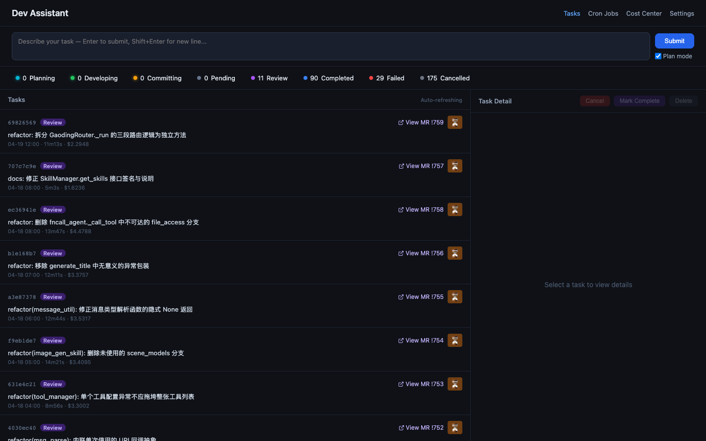
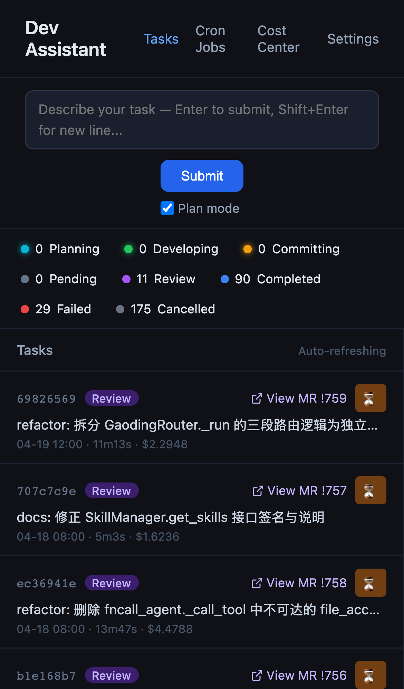

# Dev Assistant

An automated development task management system powered by Claude Code. Submit tasks through a Web UI; the system launches Claude Code in an isolated git worktree to execute them and opens a Merge Request for you to review.

[中文文档](./README.zh.md) · [Architecture](./ARCHITECTURE.md)

## Screenshots

| Desktop | Mobile |
|---------|--------|
|  |  |

---

> ### ⚠️ Before you run this
>
> Dev Assistant **executes AI-generated code and shell commands on your machine**. It is designed as a single-user local tool.
>
> - **No authentication** is built in.
> - The server binds to `0.0.0.0:8089` by default — do **not** expose it to the public internet or untrusted networks.
> - All code under `TARGET_PROJECT_PATH` may be modified, committed, and pushed automatically by the AI. Use a dedicated repository you are prepared to review carefully.
> - To restrict access to localhost only, change the bind host in [server.py](./server.py) and [manage.sh](./manage.sh) from `0.0.0.0` to `127.0.0.1`.

---

## How it works

1. You submit a task description ("add input validation to the user API")
2. Dev Assistant creates a new branch + git worktree inside your target repository
3. Claude Code runs in that worktree and writes the code
4. Claude commits the changes and opens a Merge/Pull Request
5. You review the MR/PR and merge or close it

Tasks are queued and executed one at a time, so they never conflict with each other.

### VCS support

| Provider | Status | CLI required |
|----------|--------|--------------|
| GitLab (self-hosted or gitlab.com) | ✅ Primary, well-tested | [`glab`](https://gitlab.com/gitlab-org/cli) |
| GitHub | ⚠️ Supported via [vcs_provider.py](./vcs_provider.py), less battle-tested — please [file issues](https://github.com/your-username/dev-assistant/issues) if you hit problems | [`gh`](https://cli.github.com/) |

The VCS layer is pluggable; additional providers can be added by implementing `VCSProvider` in [vcs_provider.py](./vcs_provider.py).

## Prerequisites

Verify each tool is installed before proceeding.

### Required

| Tool | Install | Verify |
|------|---------|--------|
| Python 3.11+ | [python.org](https://www.python.org/downloads/) | `python --version` |
| Git 2.15+ | [git-scm.com](https://git-scm.com/) | `git --version` |
| [Claude Code CLI](https://docs.anthropic.com/en/docs/claude-code) | `npm install -g @anthropic-ai/claude-code` | `claude --version` |
| VCS CLI — one of: [glab](https://gitlab.com/gitlab-org/cli#installation) **or** [gh](https://cli.github.com/) | See links | `glab version` / `gh --version` |
| tmux | `brew install tmux` / `apt install tmux` | `tmux -V` |
| [happy](https://github.com/slopus/happy-cli) | `npm install -g happy-coder` | `happy --version` |

> **Note on `glab`/`gh`:** Required for automatic MR/PR creation. Without it, tasks will still run and write code, but will fail at the commit/MR step. See [Without a VCS provider](#without-a-vcs-provider).
>
> **Note on `tmux` + `happy`:** Currently required. When a task reaches REVIEW, Dev Assistant unconditionally launches `happy` inside a `tmux` session for mobile pair-programming ([claude_session_manager.py:865](./claude_session_manager.py#L865)). If either is missing the post-task hook will error out. [happy](https://github.com/slopus/happy-cli) is an optional third-party tool (unaffiliated with Anthropic); when enabled, Dev Assistant links to `https://app.happy.engineering/session/<id>`. Making this toggleable via an env flag is tracked as a known limitation — contributions welcome.

## Quick Start

### 1. Install Python dependencies

```bash
pip install -r requirements.txt
```

Verify: `uvicorn --version` should print a version number.

### 2. Configure

Start the server first (step 5), then open **http://localhost:8089/settings.html** to set `TARGET_PROJECT_PATH` and other options through the UI.

> **Pick this repository carefully.** Claude will create branches, commit, and push here on its own. Use a project you own or have explicit authorisation to modify, and make sure its remote is one you're happy to receive auto-generated MRs/PRs on.

### 3. Configure your VCS CLI (for MR/PR creation)

**GitLab:**

```bash
cp .gitlab/config.yml.example .gitlab/config.yml
```

Open `.gitlab/config.yml` and fill in your GitLab token under the correct hostname. To create a token: GitLab → Settings → Access Tokens → create with `api` scope.

**GitHub:**

```bash
gh auth login
```

Dev Assistant auto-detects which provider to use based on the target repository's remote URL.

After authenticating, check the connection status on the **Settings → VCS Authentication Status** section.

### 4. Install the `finishing-feature` skill in the target project

When a task finishes, Dev Assistant invokes a Claude Code skill called `finishing-feature` inside the target project's worktree. This skill is responsible for committing the changes and opening a Merge Request via `glab`.

The skill must exist in the target project's `.claude/skills/` directory. A ready-to-use default is included in this repo:

```bash
cp -r .agents/skills/finishing-feature /path/to/your-target-project/.claude/skills/
```

The default skill works out of the box for any GitLab or GitHub project. You can customise it (commit message style, MR template, labels, etc.) by editing `SKILL.md` in the copied directory.

> **Why put the skill in the target repo instead of shipping it with Dev Assistant?** Every repository has its own conventions — commit message style, MR/PR template, labels, reviewer rules, CI gates. Those rules should live with and be owned by the repository itself, not hardcoded in a generic task runner. Putting `finishing-feature` in the target project lets each repo fully control how commits and MRs are created, and lets you evolve the rules without touching Dev Assistant.

### 5. Start

```bash
./manage.sh restart
```

`restart` is recommended over `start` — it's idempotent: if nothing is running it just starts; if something is running it cleanly stops and restarts.

Expected output:
```
[INFO]  Starting server (port: 8089)...
[SUCCESS] Server started (PID: 12345, port: 8089)
[INFO]  Visit: http://localhost:8089
```

Open `http://localhost:8089` in your browser.

> **Reminder:** the server binds to `0.0.0.0` by default — accessible from other machines on your network. If that's not what you want, edit [server.py:402](./server.py#L402) and [manage.sh:74](./manage.sh#L74) to use `127.0.0.1` before starting.

### 6. Submit your first task

In the Web UI, type a task description and click **Submit**. Watch the logs stream in real time.

---

## Without a VCS provider

If you don't have `glab` or `gh` configured, tasks will fail at the COMMITTING step. To use Dev Assistant without a VCS provider:

- Tasks will succeed through the DEVELOPING step and write code to the worktree
- Cancel the task before it reaches COMMITTING, then inspect `TARGET_PROJECT_PATH/.worktrees/task-<id>/` manually
- Or: contribute a "skip MR creation" option — see [CONTRIBUTING.md](./CONTRIBUTING.md)

## Usage

### Task modes

| Mode | Behaviour |
|------|-----------|
| **Direct** | Claude starts writing code immediately |
| **Plan** | Claude produces an implementation plan first; you approve it before development begins |

### Task lifecycle

```
PENDING
  │
  ├─(plan mode)─► PLANNING ─► (you confirm) ─►┐
  │                                            │
  └────────────────────────────────────────────►
                                               │
                                          DEVELOPING
                                               │
                                          COMMITTING
                                               │
                                            REVIEW  ◄── MR/PR open; review on GitLab or GitHub
                                               │
                                          COMPLETED  (you click "Mark complete")
                                        or FAILED / CANCELLED
```

### Cron tasks

Configure recurring automated tasks on the `/cron` page using standard cron expressions. Useful for nightly refactoring runs, automated doc updates, etc.

### Service commands

```bash
./manage.sh start           # Start the server
./manage.sh stop            # Stop (gracefully cleans up Claude processes)
./manage.sh restart         # Restart
./manage.sh status          # Show PID and port
./manage.sh logs [N]        # Print last N lines of logs (default: 50)
./manage.sh follow          # Tail logs in real time
```

---

## Configuration reference

All configuration is managed through the **Settings page** (`/settings.html`). Settings are stored in `~/.dev-assistant/config.json` and survive server restarts. Shell environment variables take precedence over saved config if both are set.

Changes to `PORT`, `DATA_DIR`, and `TARGET_PROJECT_PATH` require a server restart to take effect.

| Variable | Required | Default | Description |
|----------|----------|---------|-------------|
| `TARGET_PROJECT_PATH` | **Yes** | — | Absolute path to the git repository Claude will work in |
| `DEFAULT_BRANCH` | No | `master` | Default branch name — set to `main` if your repo uses main |
| `DATA_DIR` | No | `~/.dev-assistant` | Directory for task data and session logs |
| `PORT` | No | `8089` | HTTP port |
| `GLAB_CONFIG_DIR` | No | `.gitlab/` | Directory containing `glab`'s `config.yml` |
| `GH_CONFIG_DIR` | No | `.github/` | Directory containing `gh`'s `config.yml` |

---

## Project structure

```
dev-assistant/
├── server.py                  # FastAPI server
├── claude_session_manager.py  # Core task orchestration
├── cron_task_manager.py       # Cron scheduler
├── manage.sh                  # Start / stop / logs
├── index.html                 # Main UI
├── cron.html                  # Cron task UI
├── cost-center.html           # Cost & token usage dashboard
├── settings.html              # Settings & VCS auth UI
├── static/                    # CSS and JS
├── .gitlab/
│   └── config.yml.example     # glab config template  ← copy to config.yml
├── ARCHITECTURE.md            # How it works internally
└── PROGRESS.md                # Lessons learned during development
```

Runtime directories (created automatically):

```
~/.dev-assistant/           # Config and task data (outside the project, safe from git)
├── config.json             # All settings (edited via /settings.html)
├── dev-tasks.json          # Task database
├── cron-tasks.json         # Cron definitions
└── logs/<session-id>.jsonl # Full conversation logs per task
logs/                       # Server logs (daily rotation, git-ignored)
run/                        # PID file (git-ignored)
```

---

## Troubleshooting

**`manage.sh start` says "uvicorn not found"**

```bash
pip install -r requirements.txt
```

**`manage.sh start` says "TARGET_PROJECT_PATH is not set"**

Open `http://localhost:8089/settings.html` and set `TARGET_PROJECT_PATH`, then restart the server.

**Server starts but the first task fails immediately**

Check the server log:
```bash
./manage.sh logs 100
```

Common causes:
- `claude` CLI not installed or not authenticated → run `claude --version` and `claude login`
- `TARGET_PROJECT_PATH` doesn't have a `master` branch → set `DEFAULT_BRANCH=main` in Settings if your repo uses `main`
- `glab` or `gh` not authenticated → check **Settings → VCS Authentication Status** for the exact error and fix command

**Task stuck in DEVELOPING forever**

The Claude subprocess may have hung. Check logs with `./manage.sh follow`, then cancel the task via the UI or `DELETE /sessions/<id>`.

**Port 8089 already in use**

Change the port in **Settings → PORT**, then restart the server.

---

## Security notes

Dev Assistant is a **single-user, local-machine** tool. It was not designed for multi-user or public-network deployment.

**What the server does:**
- Runs as your user, with no login or access control
- Binds to `0.0.0.0:8089` by default (reachable from your LAN)
- Spawns `claude` subprocesses with broad tool permissions (`Bash`, `Write`, `Edit`, etc.) inside `TARGET_PROJECT_PATH`
- Lets Claude run arbitrary shell commands, commit code, and push to your remote

**Recommendations:**
- Run on `localhost` only — edit [server.py:402](./server.py#L402) and [manage.sh:74](./manage.sh#L74) to bind `127.0.0.1` before using this in a shared-network environment.
- Use a dedicated `TARGET_PROJECT_PATH` you're prepared to see mutated by the AI. Don't point it at production code.
- Review every MR/PR before merging — treat the AI's output as untrusted.
- Never store `.gitlab/config.yml` in version control (it is git-ignored by default).
- Session logs in `$DATA_DIR/logs/` contain the full Claude conversation, including all code and tool outputs. Treat them as sensitive.

---

## Contributing

See [CONTRIBUTING.md](./CONTRIBUTING.md).

## License

MIT
